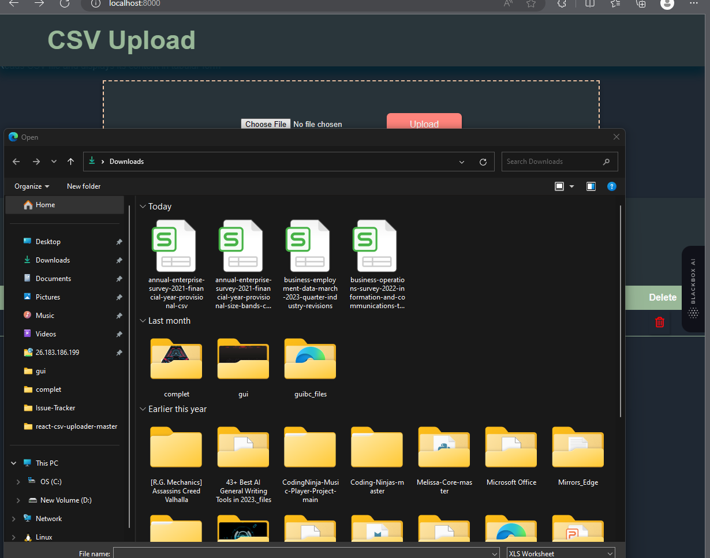
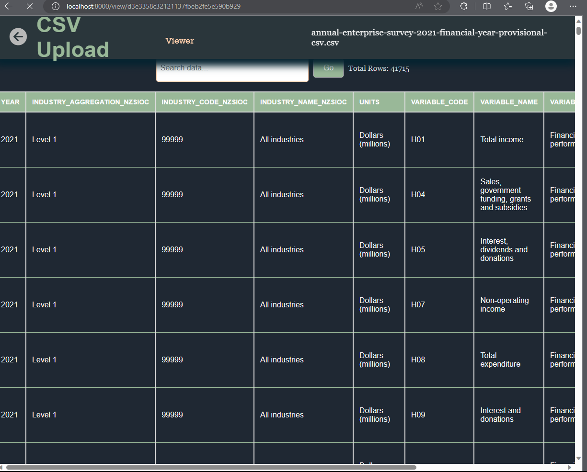

CSV_Upload - Simple CSV File Management Web Application
CSV_Upload is a user-friendly web application built with Node.js and Express that allows users to effortlessly upload, parse, and manage CSV files.

Key Features
CSV File Upload: Upload your CSV files easily using a simple web form.
CSV Data Parsing: The application automatically parses the uploaded CSV data and presents it in a clean table format.
Search Functionality: Find specific data within the table using the intuitive search feature.
Installation and Setup
Clone the repository:

bash
Copy code
$ git clone https://rajaryan1303.github.io/CSV_UPLOAD/
Install the required dependencies:

bash
Copy code
$ npm install 
Start the application:

bash
Copy code
$ npm start 
Open your web browser and access the application at:

arduino
Copy code
http://localhost:8000 
Folder Structure
The project follows a well-organized folder structure:

go
Copy code
CSV_Upload/
├── assets/
│   ├── css/
│   │   └── styles.css
│   └── js/
│       └── script.js
├── uploads/
├── index.html
├── routes/
│   └── csvRoutes.js
├── controllers/
│   └── csvController.js
├── models/
│   └── csvModel.js
├── .gitignore
├── package.json
└── README.md

Screenshots
[screen](img/img1.png)

API Reference
The application offers a simple API with the following endpoints:

POST /upload: Uploads a CSV file and processes the data.
GET /data: Retrieves the parsed CSV data in JSON format.
Contribution
Contributions to the project are welcome! If you find any issues or have suggestions for improvements, please create an issue or submit a pull request.

License
This project is licensed under the Raj aryan License.
